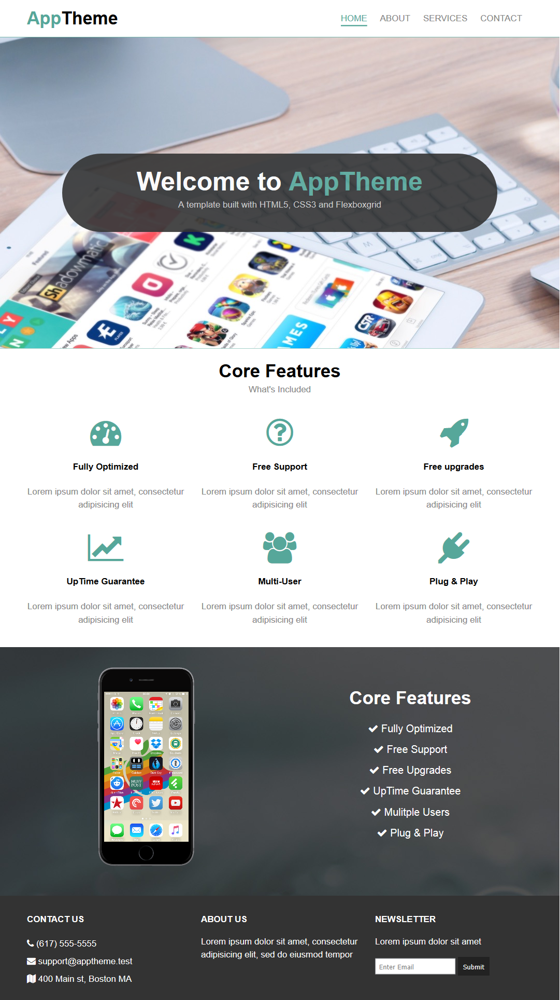

# App-Theme
A project to focuses to build website using multi branching and pull request?, in in addition, use FlexboxGrid which is a lightweight Flexbox based grid system to align our elements easily. It uses the same classes as the Bootstrap grid. 
 
## Table of contents
* [General info](#general-info)
* [Screenshots](#screenshots)
* [Technologies](#technologies)
* [Setup](#setup)
* [Features](#features)
* [Summary](#Summary)
* [Contact](#contact)

## General info
The main goal for this project is to get more familiar with branching and to build development strategy in agile way of thinking , practicing HTML5 and CSS3 , FlexboxGrid responsive template as well .

## Screenshots
This is a screen-shot of the final live demo of this project.

## Technologies
* HTML5 /CSS , FlexboxGrid responsive template .

## Setup
* Clone the repository .. 
* writing and editing the code using VS CODE ..
* push the project to github account...

## Features
The project have many user-stories as shown below , for more details for each step please read  .. 

| User-Story Name        | Branch Name        
| ------------- |:-------------:| 
|  __CreateTheSkeltonHtmlTagsForMainLandingPage__  | add-header-navbar-logo 
| __CreateTheSkeltonHtmlTagsForMainLandingPage__ | create-basic-folders-pages 
| __CreateTheMiddleSectionsForTheHtmlIndexPage__ | add-middlesections-indexpage 
|  __CreateStyleFileForTheMainLandingPage__ |  update-stylefile-forindexpage 
| __CreateServices&About&ContactPages__  | update-about-htmlpage 
| __CreateServices&About&ContactPages__  | update-services-htmlpage 
| __CreateServices&About&ContactPages__ | update-contact-htmlpage  
| __AddCssCodeForLinkedPages__ | update-style-linkedpages 
| __AddResponsiveEdge__ | add-style-mediaqueries |
  

## Summary
 ## Here you are a summery of what I struggled with, what I learned, and what skills I need to practice further.

| __My Learning points__ | react-flexbox-grid is a set of React components that implement flexboxgrid.css. It even has an optional support for CSS Modules with some extra configuration.

| __Skills to be practiced more__ |  I get more comfortable using git commands line form git bash terminal and the right sequence of pushing and pulling and branching; using felxboxgrid template as a base for a website html css3 design.

| __Struggles__ | I struggling practicing git commands line using git bash to pushing and pulling branches at first then by doing exercises going well. 

